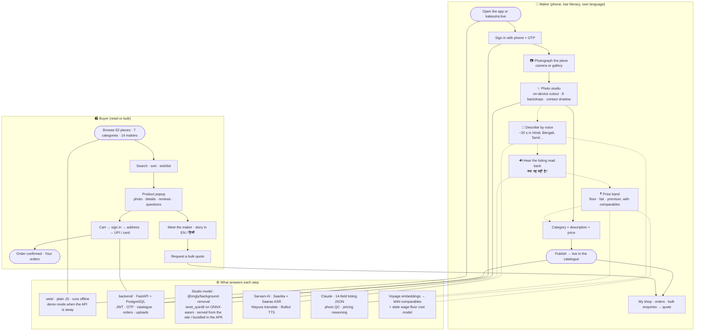
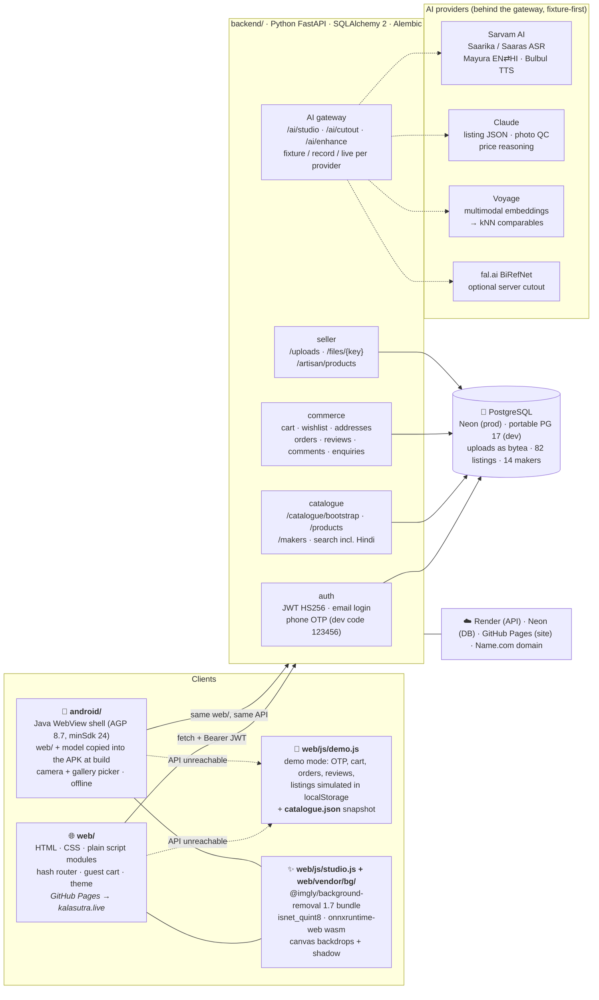

<p align="center">
  
</p>
<h1 align="center">कलाSutra</h1>
<p align="center"><b>An AI-driven marketplace and smart-cataloguing app for marginalised Indian artisans.</b><br>
A maker photographs a piece, describes it by voice in their own language, gets a fair price, and lists it. Buyers, retail and bulk, shop a catalogue that puts the maker and the craft first.</p>

<p align="center">
  <a href="https://kalasutra.live"><b>🌐 Live site</b></a> &nbsp;·&nbsp;
  <a href="https://github.com/DhruvJoshi-GIT/kalasutra/releases/latest"><b>🤖 Android beta APK</b></a> &nbsp;·&nbsp;
  <a href="docs/progress.md"><b>📋 Build status</b></a>
</p>

> Hackathon entry for *AI-Driven Market Linkage and Smart Cataloging Mobile Application for Marginalized Artisans*.

---

## The flow

What a maker and a buyer actually do, and which part of the stack answers each step. Solid arrows are built and working today; dashed arrows are the next build step (they already run in fixture mode).



## The system in one minute

Every box is a folder or a service you can point at. The site is the app: the same `web/` folder is served by GitHub Pages **and** packed into the Android APK, model included, so the studio works with no network and nothing to download.



### Tech stack at a glance

| Layer | Built with | What it does |
|---|---|---|
| Site `web/` | HTML, CSS, plain JavaScript (no build step) | Storefront, seller flow, photo studio, offline demo mode |
| Android `android/` | Java, WebView + `WebViewAssetLoader`, Gradle 8.11, AGP 8.7 | Installable app with the whole site and the studio model inside the APK |
| Photo studio | `@imgly/background-removal`, ONNX Runtime Web, Canvas | On-device cutout, backdrops, shadow: free, nothing uploaded |
| API `backend/` | Python 3.13, FastAPI, SQLAlchemy 2, Alembic, PyJWT, Pillow | Auth, catalogue, orders, uploads, seller listings, AI gateway |
| Database | PostgreSQL 17 (Neon in production, portable locally) | Everything including uploaded files (bytea) |
| Language AI | Sarvam AI (Saarika, Saaras, Mayura, Bulbul) | Indic speech to text, translation, read-back |
| Structure AI | Claude | Schema-constrained listing, photo QC, pricing rationale |
| Retrieval | Voyage embeddings, numpy kNN | Comparable pieces for the price band |
| Hosting | GitHub Pages, Render, Neon, Name.com | kalasutra.live, api.kalasutra.live |
| Testing | pytest, Playwright on Edge | 16 API tests; 140 screenshots across 7 viewports; real-click flows |

## Run it

```bash
# Site only: open web/index.html, or serve the repo root with any static server.

# API + site on http://127.0.0.1:8000 (PostgreSQL required; see docs/progress.md → How to run)
cd backend && python -m venv .venv && .venv/Scripts/pip install -r requirements.txt
.venv/Scripts/alembic upgrade head && .venv/Scripts/python scripts/seed.py
.venv/Scripts/python -m uvicorn app.main:app --port 8000

# Android beta APK (needs JDK 17 + Android SDK platform 35 / build-tools 35; set sdk.dir in android/local.properties)
cd android && ./gradlew assembleRelease
# → android/app/build/outputs/apk/release/app-release.apk
```

Demo logins: maker `9811000001` with code `123456` · buyer `demo@kalasutra.in` / `password123`.

## Status

The site is live with HTTPS, 82 listings, phone layouts down to 280 px, and the free on-device photo studio. The Android beta wraps the same site with the model bundled. The API runs locally with tests green and deploys to Render + Neon via `render.yaml`; until it is deployed the public site and the app run in demo mode. Next: the voice cataloguer and the pricing assistant in fixture mode. Details and the changelog live in `docs/progress.md`.

<br><br>

<p align="right"><sub>
<details>
<summary>📄 docs/</summary>
<sub>
<a href="docs/progress.md">progress.md</a> — the running build log and hand-off &nbsp;·&nbsp;
<a href="docs/plan.md">plan.md</a> — the build plan (v2: FastAPI + web/ + AI pipelines) &nbsp;·&nbsp;
<a href="docs/decisions.md">decisions.md</a> — append-only log of every decision and why &nbsp;·&nbsp;
<a href="docs/api-notes.md">api-notes.md</a> — verified endpoint shapes &nbsp;·&nbsp;
<a href="docs/findings.md">findings.md</a> — audit of the original Next.js base &nbsp;·&nbsp;
<a href="docs/plan-v1-nextjs.md">plan-v1-nextjs.md</a> — the earlier Next.js plan
</sub>
</details>
</sub></p>
